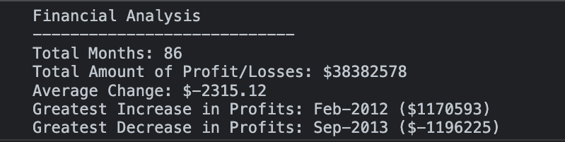

# Console Finances

## Description
This JavaScript Project was created for analyzing the financial records of a company. The process of writing the code for this project allowed me to learn JavaScript fundamentals, such as:
- **Variables**
- **Conditional statements**
- **Arrays**
- **Iteration**
- **The for Loop**

As a result, was written JavaScript code that analyzes the records and calculates following:
- **The total number of months included in the dataset**
- **The net total amount of Profit/Losses over the entire period**
- **The average of the changes in Profit/Losses over the entire period**
- **The greatest increase in profits (date and amount) over the entire period**
- **The greatest decrease in losses (date and amount) over the entire period**

## Final Result

## Installation
“N/A”

## Usage
To open deployed application, please follow the link:

## License
MIT license

